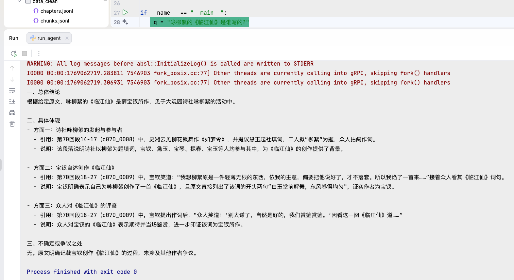
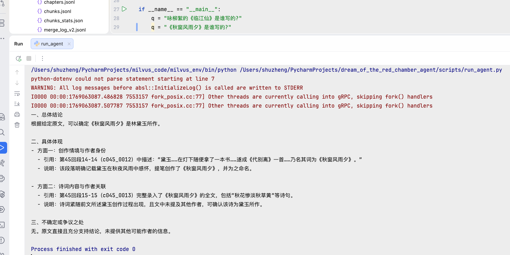
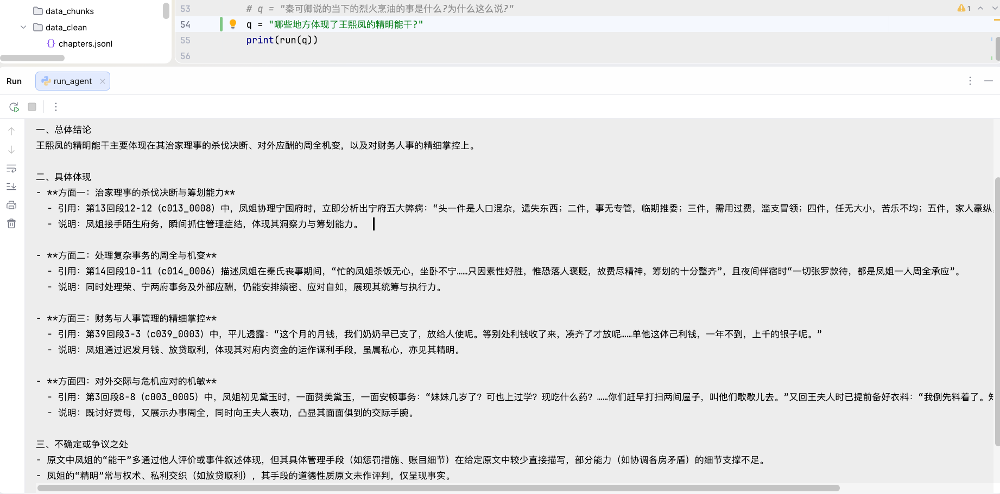
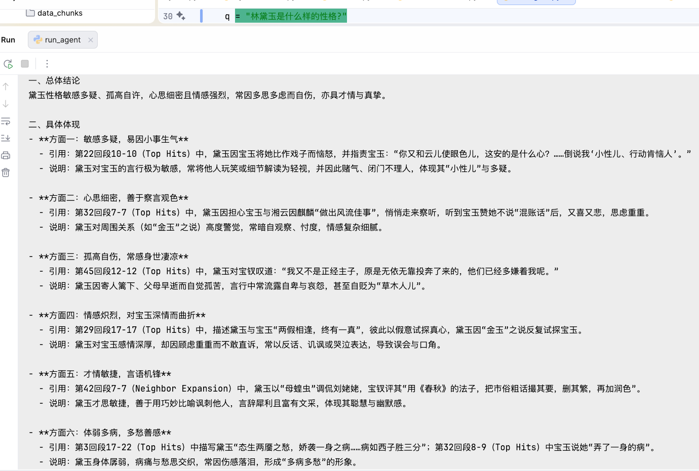
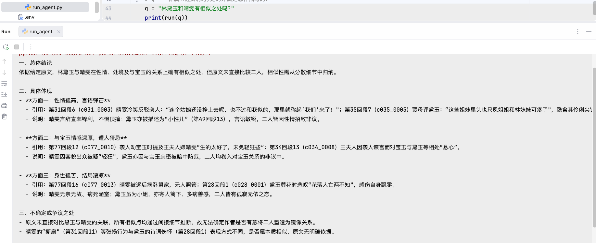

## 使用方法
修改 run_agents.py 中的q参数即可运行不同的实验。可以输入通过简单的原文检索和匹配
就能得到答案的问题, 主要通过稀疏检索即可得到答案; 也可以输入需要复杂推理和归纳才能得到
答案的问题, 这类问题主要由密集检索得到答案。
### 问题类型
1. 简单检索问题: 咏柳絮的《临江仙》是谁写的? 《秋窗风雨夕》是谁写的?
2. 复杂推索问题: 哪些地方体现了王熙凤的精明能干? 林黛玉是什么样的性格? 林黛玉和晴雯有相似之处吗?
### 回答示例
咏柳絮的《临江仙》是谁写的?

《秋窗风雨夕》是谁写的?

哪些地方体现了王熙凤的精明能干? 

林黛玉是什么样的性格? 

林黛玉和晴雯有相似之处吗?
